<h1 align="center">Hi 👋, I'm Wim Wenigerkind</h1>
<h3 align="center">16 years old • Full-Stack Developer & Home Lab / DevOps Enthusiast</h3>

- I'm currently learning **GO, PHP, Python, Symfony, Shopware and Java**
- How to reach me **info@wimwenigerkind.com**

Wakatime stats since 2025-03-25

## Current Projects

- [wimwenigerkind/odoopack](https://github.com/wimwenigerkind/odoopack) - 1 day ago
- [wimwenigerkind/wimwenigerkind.com](https://github.com/wimwenigerkind/wimwenigerkind.com) - 2 days ago
- [wimwenigerkind/odoopack-registry](https://github.com/wimwenigerkind/odoopack-registry) - 2 days ago
- [wimwenigerkind/homebrew-tap](https://github.com/wimwenigerkind/homebrew-tap) - 3 days ago
- [wimwenigerkind/docker-images-basic](https://github.com/wimwenigerkind/docker-images-basic) - 1 week ago

## Some of my recent pull requests

- https://github.com/wimwenigerkind/lf8_starter_2025_authentik/pull/30 - 3 months ago

- https://github.com/wimwenigerkind/lf8_starter_2025_authentik/pull/29 - 3 months ago

- https://github.com/wimwenigerkind/lf8_starter_2025_authentik/pull/28 - 3 months ago

- https://github.com/wimwenigerkind/lf8_starter_2025_authentik/pull/26 - 3 months ago

- https://github.com/wimwenigerkind/lf8_starter_2025_authentik/pull/25 - 3 months ago

## Stats

---

