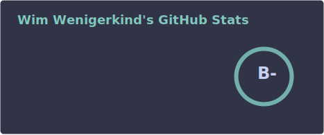

<h1 align="center">Hi 👋, I'm Wim Wenigerkind</h1>
<h3 align="center">16 years old • Full-Stack Developer & Home Lab / DevOps Enthusiast</h3>

- I'm currently learning **GO, PHP, Python, Symfony, Shopware and Java**
- How to reach me **info@wimwenigerkind.com**

Wakatime stats since 2025-03-25

## Current Projects

- [Domain-Connect/Templates](https://github.com/Domain-Connect/Templates) - 4 days ago
- [wimwenigerkind/wimwenigerkind.com](https://github.com/wimwenigerkind/wimwenigerkind.com) - 1 week ago
- [HiveStatusDev/homebrew-tap](https://github.com/HiveStatusDev/homebrew-tap) - 1 week ago
- [wimwenigerkind/haier-hc-sa164dbt-modbus](https://github.com/wimwenigerkind/haier-hc-sa164dbt-modbus) - 3 weeks ago
- [HiveStatusDev/.github](https://github.com/HiveStatusDev/.github) - 1 month ago

## Some of my recent pull requests

- https://github.com/Domain-Connect/Templates/pull/969 - 5 days ago

- https://github.com/wimwenigerkind/lf8_starter_2025_authentik/pull/30 - 5 months ago

- https://github.com/wimwenigerkind/lf8_starter_2025_authentik/pull/29 - 5 months ago

## Stats

---

