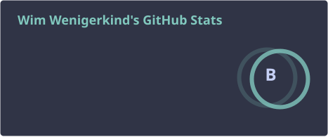

<h1 align="center">Hi 👋, I'm Wim Wenigerkind</h1>
<h3 align="center">17 years old • Full-Stack Developer & Home Lab / DevOps Enthusiast</h3>

- I'm currently learning **GO, PHP, Python, Symfony, Shopware and Java**
- How to reach me **info@wimwenigerkind.com**

## Current Projects

- [wimwenigerkind/odoopack-registry](https://github.com/wimwenigerkind/odoopack-registry) - 1 day ago
- [wimwenigerkind/wimwenigerkind.com](https://github.com/wimwenigerkind/wimwenigerkind.com) - 1 day ago
- [wimwenigerkind/odoopack](https://github.com/wimwenigerkind/odoopack) - 2 days ago
- [wimwenigerkind/odoopack-semver](https://github.com/wimwenigerkind/odoopack-semver) - 2 days ago
- [wimwenigerkind/setup-odoopack](https://github.com/wimwenigerkind/setup-odoopack) - 3 days ago

## Some of my recent pull requests

## Stats

---

